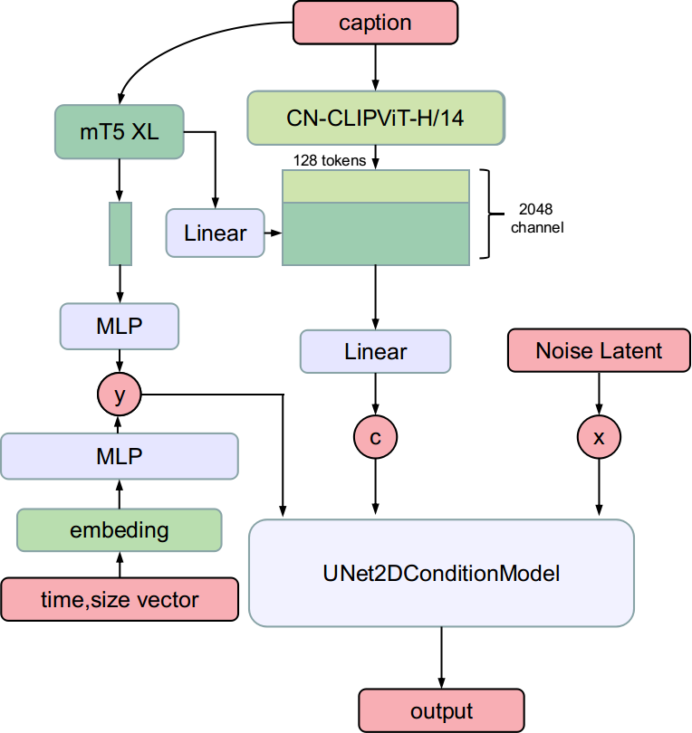

# UniT2IXL

<p align="center">
    <a href="https://huggingface.co/UnicomAI/UniT2IXL">Hugging Face</a>&nbsp;&nbsp;<a href="https://www.modelscope.cn/UnicomAI/UniT2IXL">ModelScope</a>&nbsp;&nbsp; <a href="https://www.wisemodel.cn/UnicomAI/UniT2IXL">WiseModel</a>
</p>

<figure>
  
</figure>

<br>

## 📖 介绍
UniT2IXL是由中国联通AI创新中心团队开发的一款基于潜在扩散的大规模文本到图像生成模型。该模型改进了SDXL的编码器，采用中文CLIP实现对原生中文的支持，并引入mt5架构提升对长文本的理解能力。在国产昇腾AI基础软硬件平台实现了模型从微调训练到推理的一体化适配
<p style="text-align: center;">
      
</p>


## 🚀 快速开始
### 环境依赖

* Python 3.8 or later
* PyTorch 2.4.0 or later
* Transformers 4.43.3 or later
* Diffusers 0.31.0
* Recommended: CUDA 11.7 or later
<br>

1. 快速安装

```bash
git clone https://github.com/UnicomAI/UniT2IXL.git
cd UniT2IXL
conda create -n unit2i python=3.10
conda activate unit2ixl
cd unit2ixl
pip install -r requirements.txt
```
2. 权重下载（[link](https://huggingface.co/UnicomAI/UniT2IXL)）：
```bash
huggingface-cli download --resume-download UnicomAI/UniT2IXL
```

3. 推理`demo.py`：
```bash
from pipline_unit2ixl import UniT2IXLPipeline
pipline = UniT2IXLPipeline.from_pretrained("UnicomAI/UniT2IXL")
pipline = pipline.to("cuda:0")
prompt = "在绿色的森林中，隐藏着一座白色的哥特式教堂，教堂的尖塔直指蓝色的天空，教堂周围是五彩斑斓的野花和浅黄色的草坪。"
image = pipline(prompt=prompt,guidance_scale=7.5,target_size=(1024,1024)).images[0]
```

# 训练

我们提供训练LoRA模型，使用[DeepSpeed](https://github.com/microsoft/DeepSpeed)! 支持1024x1024分辨率

### 准备数据
参考[这里](https://huggingface.co/docs/datasets/image_dataset)
* 数据结构

  ```
  folder/train/metadata.csv
  folder/train/0001.png
  folder/train/0002.png
  folder/train/0003.png
  ```
* 图像标注 metadata.csv:

  ```
  file_name,text
  0001.png,This is a golden retriever playing with a ball
  0002.png,A german shepherd
  0003.png,One chihuahua
  ```
  
### deepspeed配置样例
```
compute_environment: LOCAL_MACHINE
debug: true
deepspeed_config:
  deepspeed_multinode_launcher: standard
  gradient_accumulation_steps: 1
  gradient_clipping: 1.0
  offload_optimizer_device: none
  offload_param_device: none
  zero3_init_flag: false
  zero_stage: 2
  train_micro_batch_size_per_gpu: 6
distributed_type: DEEPSPEED
downcast_bf16: 'no'
enable_cpu_affinity: false
machine_rank: 0
main_training_function: main
mixed_precision: 'no'
num_machines: 1
num_processes: 1
rdzv_backend: static
same_network: true
tpu_env: []
tpu_use_cluster: false
tpu_use_sudo: false
use_cpu: false
```

### Lora

```
export MODEL_NAME="UnicomAI/UniT2IXL"
export DATASET_NAME="lambdalabs/naruto-blip-captions"
export ACCELERATE_CONFIG_FILE="ac.yaml"
export CUDA_VISIBLE_DEVICES=0
accelerate launch --config_file $ACCELERATE_CONFIG_FILE  --main_process_port 12345 train_text_to_image_lora_unit2ixl.py \
  --pretrained_model_name_or_path=$MODEL_NAME \
  --caption_column="text" \
  --resolution=1024 --random_flip \
  --train_batch_size=4 \
  --num_train_epochs=200 --checkpointing_steps=1000 \
  --validation_epochs=10 \
  --learning_rate=1e-04 --lr_scheduler="constant" --lr_warmup_steps=0 \
  --seed=42 \
  --rank=8 \
  --output_dir="sd-papercut-model-lora-sdxl" \
  --validation_prompt="一个龙的窗花" \
  --noise_offset=0.1 \
  --dataset_name=$DATASET_NAME
```

## 💻UniT2IXL-NPU

我们也提供了可以在NPU上运行UniT2I的LoRA训练与推理代码。更多详细信息，请参阅[unit2ixl-npu](https://github.com/UnicomAI/UniT2IXL/blob/master/unit2ixl-npu/README.md)。


